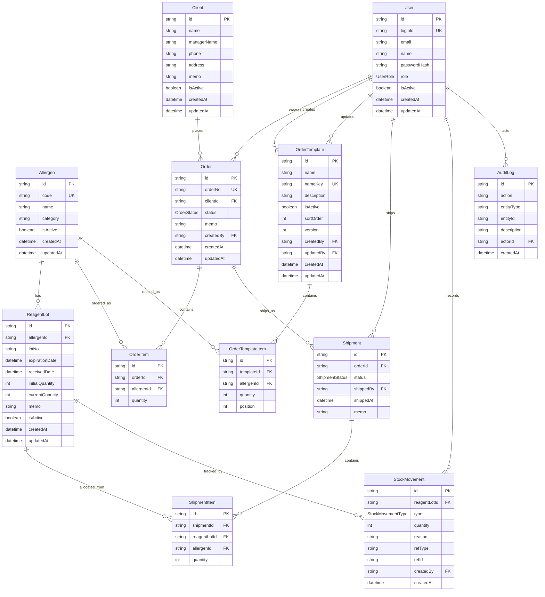

# ERD

This document summarizes the current database model defined in `prisma/schema.prisma`.

## User-Facing Terminology

The Prisma schema keeps technical names for consistency, while the UI now uses friendlier operational terms.

| Schema Term | User-Facing Term |
|---|---|
| `Allergen` | 시약 |
| `ReagentLot` | 입고분 / 제조번호별 재고 |
| `lotNo` | 제조번호 |
| `expirationDate` | 유통기한 |
| `currentQuantity` | 현재 수량 |
| `initialQuantity` | 입고 수량 |
| `StockMovement` | 입출고 이력 |
| `REVERSE` | 출고취소/재고복구 기록 |
| FEFO | 유통기한 빠른 순 |

## Diagram

## Tables

| Table | Purpose |
|---|---|
| `User` | System user and role information. |
| `Allergen` | Master data for allergen/reagent item codes. |
| `ReagentLot` | LOT-level inventory with expiration and quantity. |
| `Client` | Customer or hospital information. |
| `Order` | Customer order header. |
| `OrderItem` | Allergen and quantity requested in an order. |
| `OrderTemplate` | Globally reusable order-item set; it is intentionally not mapped to a client. |
| `OrderTemplateItem` | Ordered reagent and default quantity stored in an order template. |
| `Shipment` | Shipment header for an order. |
| `ShipmentItem` | Actual LOT allocations shipped. |
| `StockMovement` | Inventory movement audit log. |
| `AuditLog` | Actor-linked audit record for critical business and administration operations. |

## Core Rules

| Rule | Definition |
|---|---|
| Allergen code uniqueness | `Allergen.code` is unique. |
| User login ID uniqueness | `User.loginId` is unique. |
| Order number uniqueness | `Order.orderNo` is unique. |
| LOT uniqueness | `ReagentLot` is unique by `allergenId + lotNo + expirationDate`. |
| LOT inventory unit | Inventory is managed at the `ReagentLot` level, not only at the allergen level. |
| Shipment allocation | Actual outbound stock is recorded through `ShipmentItem.reagentLotId`. |
| Movement audit | Stock changes are tracked through `StockMovement`. |
| Global order templates | `OrderTemplate` has no `Client` foreign key and is shared across all customer orders. |
| Template name uniqueness | Normalized `OrderTemplate.nameKey` is unique. |
| Template item uniqueness | Each reagent and each position can occur only once per template. |
| Active reagent policy | Create, update, and reactivation require every template reagent to be active; a template containing a reagent deactivated later cannot be applied to an order draft. |
| Optimistic concurrency | Template update and activation changes compare `version` and increment it atomically. |
| Template audit | Create, update, activation, and deactivation write an `AuditLog` entry in the same transaction. |

## Enums

### UserRole

| Value | Meaning |
|---|---|
| `ADMIN` | Administrator |
| `ORDER_MANAGER` | Order manager |
| `SHIPMENT_MANAGER` | Shipment manager |
| `VIEWER` | Read-only user |

### OrderStatus

| Value | Meaning |
|---|---|
| `RECEIVED` | Order received |
| `READY_TO_SHIP` | Ready to ship |
| `SHIPPED` | Shipped |
| `CANCELLED` | Cancelled |

### ShipmentStatus

| Value | Meaning |
|---|---|
| `SHIPPED` | Shipped |
| `CANCELLED` | Cancelled |

### StockMovementType

| Value | Meaning |
|---|---|
| `IN` | Inbound stock |
| `OUT` | Outbound stock |
| `ADJUST` | Manual adjustment |
| `DISPOSE` | Disposal |
| `REVERSE` | Shipment cancellation / stock restoration |

## Indexes

| Model | Index |
|---|---|
| `Allergen` | `name` |
| `ReagentLot` | `lotNo` |
| `ReagentLot` | `expirationDate` |
| `ReagentLot` | `currentQuantity` |
| `Order` | `status` |
| `Order` | `createdAt` |
| `OrderTemplate` | `isActive, sortOrder, name` |
| `OrderTemplate` | `createdBy` |
| `OrderTemplate` | `updatedBy` |
| `OrderTemplateItem` | unique `templateId, allergenId` |
| `OrderTemplateItem` | unique `templateId, position` |
| `OrderTemplateItem` | `allergenId` |
| `AuditLog` | `createdAt` |
| `AuditLog` | `entityType, entityId` |
| `AuditLog` | `actorId` |
| `Shipment` | `shippedAt` |
| `StockMovement` | `createdAt` |
