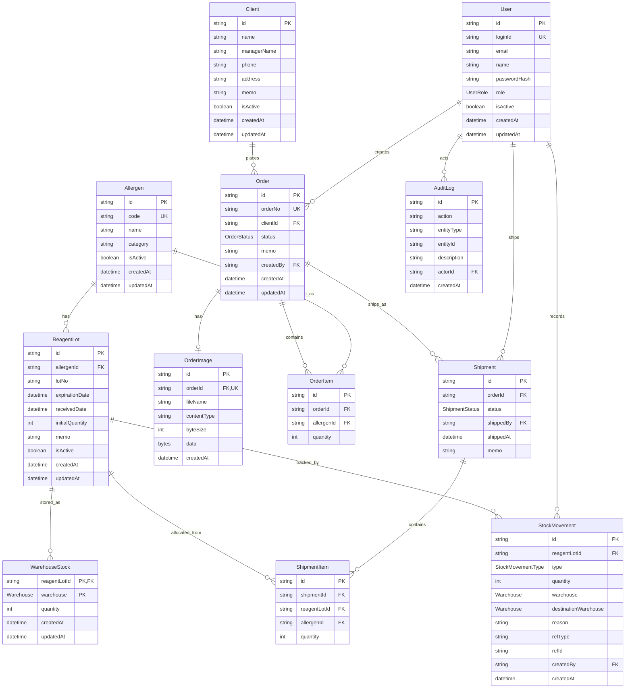

# ERD

This document summarizes the current database model defined in `prisma/schema.prisma`.

## User-Facing Terminology

The Prisma schema keeps technical names for consistency, while the UI now uses friendlier operational terms.

| Schema Term | User-Facing Term |
|---|---|
| `Allergen` | 시약 |
| `ReagentLot` | 입고분 / 제조번호별 재고 |
| `lotNo` | 제조번호 |
| `expirationDate` | 유통기한 |
| `WarehouseStock.quantity` | 창고별 현재 수량의 단일 원천 |
| `initialQuantity` | 입고 수량 |
| `StockMovement` | 입출고 이력 |
| `REVERSE` | 출고취소/재고복구 기록 |
| `TRANSFER` | 창고 간 재고 이동 기록 |
| FEFO | 유통기한 빠른 순 |

## Diagram

## Tables

| Table | Purpose |
|---|---|
| `User` | System user and role information. |
| `Allergen` | Master data for allergen/reagent item codes. |
| `ReagentLot` | Stable LOT identity, receipt, and expiration data. |
| `WarehouseStock` | The authoritative mutable quantity for one LOT and warehouse. |
| `Client` | Customer or hospital information. |
| `Order` | Customer order header. |
| `OrderImage` | Optional authenticated image attachment, one per order. |
| `OrderItem` | Allergen and quantity requested in an order. |
| `Shipment` | Shipment header for an order. |
| `ShipmentItem` | Actual LOT allocations shipped. |
| `StockMovement` | Inventory movement audit log. |
| `AuditLog` | Actor-linked audit record for critical business and administration operations. |

## Core Rules

| Rule | Definition |
|---|---|
| Allergen code uniqueness | `Allergen.code` is unique. |
| User login ID uniqueness | `User.loginId` is unique. |
| Order number uniqueness | `Order.orderNo` is unique. |
| Order image | `OrderImage.orderId` is unique; content is JPEG/PNG/WebP, 1–3 MiB, and byte length must match metadata. |
| LOT uniqueness | `ReagentLot` is unique by `allergenId + lotNo + expirationDate`. |
| Warehouse balance unit | Inventory is managed by the unique `reagentLotId + warehouse` balance; `ReagentLot` does not duplicate current quantity. |
| Shipment allocation | Actual outbound stock is recorded through `ShipmentItem.reagentLotId`. |
| Finished-goods shipment | Normal and replacement shipments allocate only `FINISHED_GOODS` balances. |
| Movement audit | Stock changes are tracked through `StockMovement`; a partial warehouse move is one `TRANSFER` row with source and destination. |
| Disposal distinction | Moving into `DISPOSAL` preserves physical quantity; `DISPOSE` removes quantity after actual disposal. |

## Enums

### UserRole

| Value | Meaning |
|---|---|
| `ADMIN` | Administrator |
| `ORDER_MANAGER` | Order manager |
| `SHIPMENT_MANAGER` | Shipment manager |
| `VIEWER` | Read-only user |

### OrderStatus

| Value | Meaning |
|---|---|
| `RECEIVED` | Order received |
| `READY_TO_SHIP` | Ready to ship |
| `SHIPPED` | Shipped |
| `CANCELLED` | Cancelled |

### ShipmentStatus

| Value | Meaning |
|---|---|
| `SHIPPED` | Shipped |
| `CANCELLED` | Cancelled |

### StockMovementType

| Value | Meaning |
|---|---|
| `IN` | Inbound stock |
| `OUT` | Outbound stock |
| `ADJUST` | Manual adjustment |
| `DISPOSE` | Disposal |
| `REVERSE` | Shipment cancellation / stock restoration |
| `TRANSFER` | Warehouse-to-warehouse transfer with zero total inventory delta |

### Warehouse

| Value | Meaning |
|---|---|
| `FINISHED_GOODS` | 완제품 |
| `SAMPLE` | 검체 |
| `RETURNED` | 반품 |
| `NONCONFORMING` | 부적합 |
| `DISPOSAL` | 폐기 |

## Indexes

| Model | Index |
|---|---|
| `Allergen` | `name` |
| `ReagentLot` | `lotNo` |
| `ReagentLot` | `expirationDate` |
| `WarehouseStock` | `warehouse, quantity` |
| `Order` | `status` |
| `Order` | `createdAt` |
| `AuditLog` | `createdAt` |
| `AuditLog` | `entityType, entityId` |
| `AuditLog` | `actorId` |
| `Shipment` | `shippedAt` |
| `StockMovement` | `createdAt` |
| `StockMovement` | `warehouse, createdAt` |
| `StockMovement` | `destinationWarehouse, createdAt` |
